# 🎫 Affiliate Voucher Database Engine (High-Concurrency PostgreSQL)

[](https://www.postgresql.org/)
[](https://github.com/)
[-success?style=for-the-badge)](https://github.com/)
[](https://github.com/)

## 📖 Tổng Quan

**Affiliate Voucher Database Engine** là hệ thống cơ sở dữ liệu quan hệ cấp production được xây dựng trên **PostgreSQL 15+**, mô phỏng quy trình quản lý chương trình Tiếp thị Liên kết (Affiliate Marketing) và Phát hành Voucher cho một doanh nghiệp thương mại điện tử mỹ phẩm tại Việt Nam.

Dự án tập trung chứng minh cách **bảo vệ tính nhất quán dữ liệu**, **ngăn chặn thất thoát ngân sách khuyến mãi**, và **xử lý hàng trăm request đồng thời trong Flash Sale** chỉ bằng các cơ chế bảo vệ ở tầng Database (Constraints, Triggers, Isolation Levels) — không phụ thuộc vào tầng ứng dụng.

---

## 🏢 Bối Cảnh Doanh Nghiệp & Bài Toán Cần Giải Quyết

Bạn vừa gia nhập đội ngũ Kỹ sư Dữ liệu (Data Engineer) của một nền tảng thương mại điện tử chuyên doanh mỹ phẩm trực tuyến tại Việt Nam. Giám đốc Marketing đưa ra **3 bài toán nhức nhối** từ hệ thống cũ:

| # | Vấn Đề | Hậu Quả Thực Tế |
|---|---|---|
| 1️⃣ | **Cháy Quỹ Khuyến Mãi (Voucher Over‑spending)** | Flash Sale 12.12 — voucher FREESHIP có hạn mức 1 000 mã, đã phát 999, chỉ còn **1 slot cuối**. **10 khách** nhấn "Lưu mã" cùng 1 mili‑giây. Cả 10 luồng đọc `total_issued = 999`, cả 10 đều thấy "còn chỗ" → hệ thống phát hành **1 009** mã. Âm quỹ 9 mã, Marketing phải tự bỏ tiền túi bù. |
| 2️⃣ | **Tính Hoa Hồng Thủ Công** | Phòng kế toán mất **3 ngày công/tháng** đối soát hoa hồng đối tác bằng Excel + VLOOKUP. Tháng trước trả thừa **8 triệu đồng** do trùng lặp bản ghi. |
| 3️⃣ | **Gian Lận Click Ảo (Click Fraud)** | "Pháp sư MMO" lập trình bot bắn **500 clicks** từ cùng 1 IP trong 1 phút, tự liên kết voucher để nhận hoa hồng bất hợp pháp. Hệ thống không lưu metadata (`ip_address`, `clicked_at`) → thiếu bằng chứng đối soát. |

**Mục tiêu:** Thiết kế lại tầng dữ liệu sao cho **Database là chốt chặn cuối cùng** — dù tầng ứng dụng có bug, crash, hay bị race condition, dữ liệu vẫn không bao giờ sai.

---

## 🔑 Triết Lý Thiết Kế: Tính Nhất Quán (Consistency) Bằng Ràng Buộc Cơ Sở Dữ Liệu

Trong ACID, chữ **C** là **Consistency** — mọi giao dịch phải đưa cơ sở dữ liệu từ trạng thái hợp lệ này sang trạng thái hợp lệ khác. Nhưng Database biết thế nào là "hợp lệ" nhờ các **Constraints**:

| Loại Ràng Buộc | Mục Đích | Ví Dụ Trong Dự Án |
|---|---|---|
| **UNIQUE** | Ngăn bản ghi trùng lặp | 1 số điện thoại = 1 tài khoản duy nhất (`customer.phone_number`) |
| **CHECK đơn cột** | Kiểm tra giá trị số/văn bản hợp lệ | Tỷ lệ hoa hồng phải dương (`payout_rate > 0`) |
| **CHECK đa cột** | So sánh 2 cột với nhau | Số voucher đã phát không được vượt hạn mức (`total_issued ≤ issuance_limit`) |
| **Trigger** | Tự động hóa bảo trì dữ liệu | Tự động cập nhật `updated_at` mỗi khi có `UPDATE`, ghi audit log |

---

## 🏗️ Kiến Trúc Hệ Thống (Entity Relationship Diagram)

```mermaid
erDiagram
    STATUS_MASTER {
        bigint status_id PK
        varchar status_code
        varchar status_name
        varchar entity_type
        boolean is_final
        timestamp created_at
        varchar created_by
        timestamp updated_at
        varchar updated_by
        boolean is_deleted
        timestamp deleted_at
        varchar deleted_by
    }
    STATUS_TRANSITION {
        bigint transition_id PK
        varchar entity_type
        bigint from_status_id FK
        bigint to_status_id FK
        timestamp created_at
        varchar created_by
    }
    COMMISSION_RULE {
        bigint commission_rule_id PK
        varchar rule_name
        decimal payout_rate
        text conditions
        timestamp created_at
        varchar created_by
        timestamp updated_at
        varchar updated_by
        boolean is_deleted
        timestamp deleted_at
        varchar deleted_by
    }
    PARTNER {
        bigint partner_id PK
        varchar partner_code UK
        varchar partner_name
        bigint commission_rule_id FK
        timestamp created_at
        varchar created_by
        timestamp updated_at
        varchar updated_by
        boolean is_deleted
        timestamp deleted_at
        varchar deleted_by
    }
    PROMOTION_PROGRAM {
        bigint program_id PK
        varchar program_name
        numeric budget_limit
        timestamp start_at
        timestamp end_at
        bigint status_id FK
        timestamp created_at
        varchar created_by
        timestamp updated_at
        varchar updated_by
        boolean is_deleted
        timestamp deleted_at
        varchar deleted_by
    }
    VOUCHER {
        bigint voucher_id PK
        bigint program_id FK
        bigint status_id FK
        varchar voucher_code UK
        varchar discount_type
        numeric discount_amount
        int issuance_limit
        int total_issued
        timestamp valid_from
        timestamp expired_at
        timestamp created_at
        varchar created_by
        timestamp updated_at
        varchar updated_by
        boolean is_deleted
        timestamp deleted_at
        varchar deleted_by
    }
    CUSTOMER {
        bigint customer_id PK
        varchar first_name
        varchar middle_name
        varchar last_name
        varchar phone_number UK
        varchar email UK
        date date_of_birth
        varchar gender
        text address
        varchar province
        varchar district
        varchar ward
        bigint status_id FK
        timestamp created_at
        varchar created_by
        timestamp updated_at
        varchar updated_by
        boolean is_deleted
        timestamp deleted_at
        varchar deleted_by
    }
    PARTNER_CLICK {
        varchar click_id PK
        bigint partner_id FK
        varchar partner_code
        varchar ip_address
        timestamp clicked_at
        boolean is_suspicious
        boolean is_orphaned
        bigint reconciliation_status_id
        timestamp reconciled_at
        varchar reconciled_by
        timestamp created_at
        varchar created_by
        boolean is_deleted
        timestamp deleted_at
        varchar deleted_by
    }
    CUSTOMER_VOUCHER {
        bigint customer_voucher_id PK
        bigint customer_id FK
        bigint voucher_id FK
        varchar click_id FK
        bigint partner_id FK
        bigint order_id
        varchar order_external_code
        bigint status_id FK
        timestamp saved_at
        timestamp applied_at
        timestamp refunded_at
        timestamp cancelled_at
        timestamp created_at
        varchar created_by
        timestamp updated_at
        varchar updated_by
        boolean is_deleted
        timestamp deleted_at
        varchar deleted_by
    }
    AFFILIATE_COMMISSION {
        bigint commission_id PK
        bigint customer_voucher_id FK
        bigint commission_rule_id FK
        bigint status_id FK
        numeric payout_rate
        numeric commission_amount
        timestamp approved_at
        timestamp paid_at
        text rejection_reason
        timestamp created_at
        varchar created_by
        timestamp updated_at
        varchar updated_by
        boolean is_deleted
        timestamp deleted_at
        varchar deleted_by
    }
    COMMISSION_ADJUSTMENT {
        bigint adjustment_id PK
        bigint commission_id FK
        numeric amount
        text reason
        bigint status_id FK
        timestamp created_at
        varchar created_by
    }
    BUDGET_TRANSACTION {
        bigint transaction_id PK
        bigint program_id FK
        varchar entry_type
        numeric amount
        text description
        varchar reference_id
        varchar reference_type
        timestamp created_at
        varchar created_by
        timestamp updated_at
        varchar updated_by
        boolean is_deleted
        timestamp deleted_at
        varchar deleted_by
    }
    STATUS_TRANSITION }|--|| STATUS_MASTER : "from_status"
    STATUS_TRANSITION }|--|| STATUS_MASTER : "to_status"
    PARTNER }|--|| COMMISSION_RULE : "uses"
    PROMOTION_PROGRAM }|--|| STATUS_MASTER : "status"
    VOUCHER }|--|| PROMOTION_PROGRAM : "belongs_to"
    VOUCHER }|--|| STATUS_MASTER : "status"
    CUSTOMER }|--|| STATUS_MASTER : "status"
    PARTNER_CLICK }|--|| PARTNER : "belongs_to"
    CUSTOMER_VOUCHER }|--|| CUSTOMER : "claimed_by"
    CUSTOMER_VOUCHER }|--|| VOUCHER : "refers_to"
    CUSTOMER_VOUCHER }|--|| PARTNER_CLICK : "attributes_to"
    CUSTOMER_VOUCHER }|--|| PARTNER : "attributed_to"
    CUSTOMER_VOUCHER }|--|| STATUS_MASTER : "status"
    AFFILIATE_COMMISSION }|--|| CUSTOMER_VOUCHER : "calculated_from"
    AFFILIATE_COMMISSION }|--|| COMMISSION_RULE : "rates_from"
    AFFILIATE_COMMISSION }|--|| STATUS_MASTER : "status"
    COMMISSION_ADJUSTMENT }|--|| AFFILIATE_COMMISSION : "adjusts"
    COMMISSION_ADJUSTMENT }|--|| STATUS_MASTER : "status"
    BUDGET_TRANSACTION }|--|| PROMOTION_PROGRAM : "modifies_budget"
```



### 💡 Các Design Pattern Đặc Trưng

1. **Double‑Entry Ledger (Sổ Cái Kép)** — Mọi biến động ngân sách khuyến mãi đều đi qua bảng `budget_transaction` thay vì cập nhật trực tiếp `remaining_budget`. Đảm bảo vết kiểm toán tài chính (audit trail) bất biến.
2. **State‑Machine Constraint** — Bảng `status_master` + `status_transition` kiểm soát vòng đời thực thể. Ví dụ: không cho phép chuyển từ `DRAFT` nhảy thẳng sang `ENDED` mà phải qua `ACTIVE`.
3. **Soft‑Delete & Partial Indexes** — Cờ `is_deleted = FALSE` kết hợp chỉ mục chọn lọc (Partial Index) giúp cây B‑Tree nhỏ gọn, bỏ qua bản ghi đã xóa, tăng tốc truy vấn:
   ```sql
   CREATE INDEX idx_voucher_program ON linh_lab.voucher(program_id) WHERE is_deleted = FALSE;
   ```

---

## 📁 Cấu Trúc Thư Mục Dự Án

```text
├── database/
│   ├── DDL.sql                  # Định nghĩa Schema, Tables, Constraints, Indexes
│   └── seed.sql                 # Dữ liệu mẫu cho các kịch bản kiểm thử
└── tasks/
    ├── task_01_crud_autocommit/
    │   ├── crud_operations.sql
    │   └── README.md
    ├── task_02_transactions/
    │   ├── transaction_blocks.sql
    │   └── README.md
    ├── task_03_constraints/
    │   ├── constraints_consistency.sql
    │   └── README.md
    └── task_04_concurrency/
        ├── concurrency_control.sql
        ├── flash_sale_test.sql   # Script SQL dùng cho pgbench stress test
        └── README.md
```

---

## 📚 Chi Tiết Từng Bài Thực Hành

### Bài 1 — CRUD & Bẫy Tự Động Xác Nhận (Autocommit Trap)

**Mục tiêu:** Nhận thức rõ cơ chế Autocommit mặc định của SQL Client và hiểm họa khi thực hiện nhiều lệnh ghi liên quan mà không bọc trong Transaction.

**Kịch bản:** Cập nhật `total_issued` của voucher đồng thời với việc ghi sổ cái `budget_transaction`. Nếu câu lệnh thứ 2 bị lỗi giữa chừng, bản ghi thứ 1 vẫn đã được lưu (do Autocommit) → lệch ngân sách, xuất hiện bản ghi mồ côi.

**Giải pháp:** Bọc khối lệnh trong `BEGIN ... COMMIT` để đảm bảo tính toàn vẹn (Atomicity).

📖 [Xem hướng dẫn chi tiết →](tasks/task_01_crud_autocommit/README.md)

---

### Bài 2 — Giao Dịch Đa Bước & Savepoints (Atomicity)

**Mục tiêu:** Thực hiện kịch bản khách hàng đăng ký tài khoản mới và nhận voucher chào mừng một cách đồng thời.

**Kỹ thuật sử dụng:**
- `RETURNING customer_id` — lấy ID tự tăng của bản ghi vừa tạo trong cùng 1 phiên, không cần truy vấn lại.
- `SAVEPOINT` — cô lập bước phát voucher. Nếu voucher hết hạn, chỉ `ROLLBACK TO SAVEPOINT` bước phát voucher, vẫn giữ thông tin khách hàng mới đăng ký.

📖 [Xem hướng dẫn chi tiết →](tasks/task_02_transactions/README.md)

---

### Bài 3 — Phòng Thủ Vật Lý: Constraints & Triggers (Consistency)

#### ✅ Bước 0 — Khám Phá Dữ Liệu (Prerequisites)

**Bước 0‑A: Lấy thông tin voucher hiện tại**
```sql
SELECT v.voucher_id, v.program_id, v.issuance_limit, v.total_issued
FROM   linh_lab.voucher v
LIMIT 5;
```
> Chọn 1 dòng bất kỳ, ghi nhớ `voucher_id` để dùng trong các bước tiếp theo.

#### 📖 Nội dung bài thực hành

| # | Ràng Buộc | Bảng | Mục Đích |
|---|---|---|---|
| A | `UNIQUE` trên `phone_number` | `customer` | Ngăn trùng lặp tài khoản khách hàng |
| B | `CHECK (payout_rate > 0)` | `commission_rule` | Đảm bảo tỷ lệ hoa hồng hợp lệ |
| C | `CHECK (total_issued <= issuance_limit)` | `voucher` | Ngăn phát voucher vượt hạn mức — **chốt chặn cuối cùng chống cháy quỹ** |
| D | `TRIGGER trg_promotion_program_updated_at` | `promotion_program` | Tự động cập nhật `updated_at` khi có thay đổi |

📖 [Xem hướng dẫn chi tiết →](tasks/task_03_constraints/README.md)

---

### Bài 4 — Kiểm Soát Tranh Chấp Đồng Thời & Kiểm Thử Tải (Concurrency)

#### 🔒 Ma Trận So Sánh 3 Chiến Lược Concurrency

| Phương Pháp | Loại Khóa | Cơ Chế | Throughput | Tỉ Lệ Lỗi | Phù Hợp Cho |
|---|---|---|---|---|---|
| `SELECT FOR UPDATE` | Bi quan (Pessimistic) | Xếp hàng chờ khóa được giải phóng | Thấp | 0% | Hệ thống nhỏ, yêu cầu không lỗi |
| `SELECT FOR UPDATE NOWAIT` | Bi quan — Fail Fast | Thất bại ngay nếu dòng đang bị khóa | Cao | Cao (cần retry) | Hệ thống tải cao, tránh nghẽn connection pool |
| `SERIALIZABLE` Isolation | Lạc quan (Optimistic) | Không khóa khi đọc/ghi, kiểm tra xung đột lúc COMMIT | Rất cao | Trung bình | Hệ thống thiên về đọc, tỉ lệ ghi chéo thấp |

#### Kịch Bản E — Kiểm Thử Tải Flash Sale 500 Request (pgbench)

**Bước 1:** Script kiểm thử đã có sẵn tại `tasks/task_04_concurrency/flash_sale_test.sql`:
```sql
BEGIN;
SELECT total_issued FROM linh_lab.voucher WHERE voucher_id = 1 FOR UPDATE;
UPDATE linh_lab.voucher SET total_issued = total_issued + 1 WHERE voucher_id = 1;
COMMIT;
```

**Bước 2:** Reset `total_issued` về `0` trong SQL Editor.

**Bước 3:** Chạy `pgbench` — 100 client đồng thời, mỗi client 5 giao dịch (tổng 500 request):
```bash
pgbench -U postgres -d postgres -c 100 -t 5 -f tasks/task_04_concurrency/flash_sale_test.sql
```

**Bước 4:** Kiểm chứng kết quả:
```sql
SELECT total_issued, issuance_limit FROM linh_lab.voucher WHERE voucher_id = 1;
```
> `total_issued` tăng đúng bằng số giao dịch thành công và **tuyệt đối không vượt quá** `issuance_limit` — nhờ bảo vệ kép: khóa bi quan (`FOR UPDATE`) + ràng buộc cứng (`chk_total_issued`).

#### Kịch Bản F — Giám Sát & Cảnh Báo (Mở Rộng)

**Ý tưởng:** Sử dụng `pg_notify` của PostgreSQL kết hợp một watcher đơn giản (Node.js / Python) để gửi cảnh báo real‑time khi quota voucher sắp cạn kiệt. *(Bài tập mở rộng cho người đọc.)*

📖 [Xem phân tích chi tiết →](tasks/task_04_concurrency/README.md)

---

## ⚙️ Yêu Cầu Hệ Thống (Prerequisites)

| Công Cụ | Phiên Bản | Kiểm Tra |
|---|---|---|
| PostgreSQL | 15+ | `psql --version` |
| pgbench | (đi kèm PostgreSQL) | `pgbench --version` |
| Git | bất kỳ | `git --version` |

---

## ⚡ Hướng Dẫn Khởi Chạy Nhanh (Quick Start)

**Bước 1:** Khởi tạo Schema và các bảng cấu trúc
```bash
psql -U postgres -d postgres -f database/DDL.sql
```

**Bước 2:** Nạp dữ liệu mẫu
```bash
psql -U postgres -d postgres -f database/seed.sql
```

**Bước 3:** Chạy kiểm thử tải Flash Sale (xem Kịch Bản E ở trên)

---

## ✨ Tại Sao Dự Án Này Đạt Chuẩn Portfolio

- ✅ **Giải pháp end‑to‑end** cho bài toán thực tế trong ngành E‑commerce.
- ✅ **Mọi quy tắc nghiệp vụ đều được bảo vệ ở tầng Database** — không phụ thuộc application code.
- ✅ **Kiểm thử hiệu năng thực tế** với `pgbench` (≥ 7 800 TPS trên laptop).
- ✅ **Tài liệu cấp phỏng vấn** — bao gồm ERD, giải thích design pattern, và bài thực hành từng bước.
- ✅ **Dễ clone, chạy, và mở rộng** — phù hợp để chia sẻ trên GitHub.

---

*© 2026 Affiliate Voucher DB — All rights reserved.*
